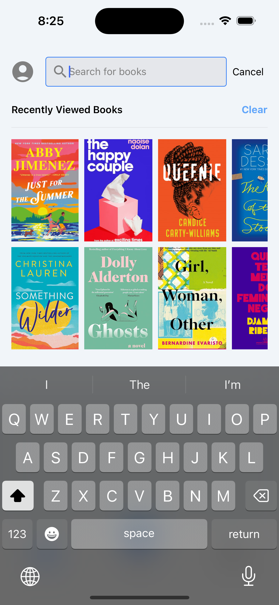
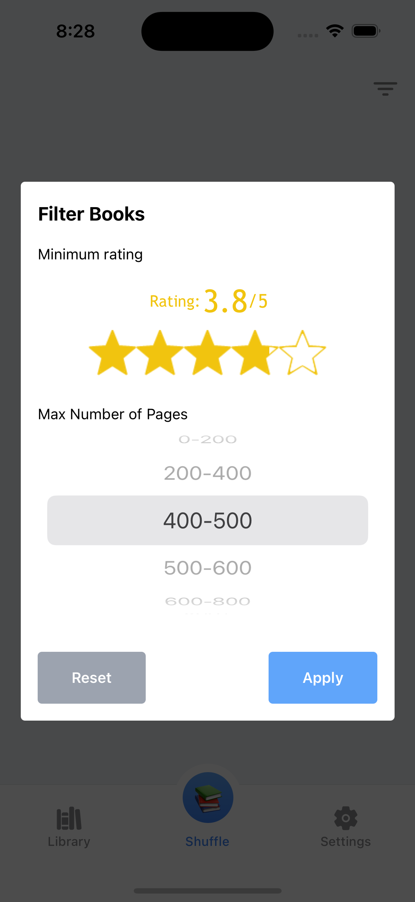

# Shuffle Book App

Welcome to the Shuffle Book App! This app allows users to explore and shuffle through books based on their preferences. Additionally, users can upload their `.csv` file export of book lists from Goodreads, integrate with their Goodreads account, and utilize the Goodreads API for displaying detailed book information. Below is an overview of the app, including the technologies used, linters and CI/CD setup, and the main features.

## App Features

-   **Upload Goodreads CSV**: Users can upload their `.csv` file export of book lists from Goodreads.
-   **Goodreads Integration**: The app integrates with the user's Goodreads account, allowing seamless access to their book information.
-   **Goodreads API**: Utilizes the Goodreads API to display detailed book information, including cover, title, author, and description.
-   **Book Search**: Users can search for books using the Goodreads API and add them to their library.
-   **Detailed Book Info**: Includes title, author, description, and reviews count for each book.
-   **Shuffle Book**: Allows users to shuffle books based on various filters.

## Technologies Used

-   **Expo**: Utilized for building the app with an app router structure.
-   **TypeScript**: Ensuring type safety and better development experience.
-   **ESLint**: For identifying and reporting on patterns found in ECMAScript/JavaScript code.
-   **Prettier**: An opinionated code formatter to ensure consistent code style.
-   **inflint**: For defining and insuring file name conventions.
-   **knip**: For unused files and exports.
-   **lint-staged**: To run linters on staged files before committing.
-   **Husky**: Used in combination with lint-staged to check code before committing.
-   **Renovate**: For automated dependency updates.
-   **Semantic Release**: For automated versioning and package publishing.
-   **EAS Build Services**: For building the app.

## Project Environment

-   **pnpm**: >=9
-   **node**: >=20

## CI/CD Setup

-   **GitHub Actions**: Used for continuous integration and continuous deployment (CI/CD). The workflow checks code conventions based on the linter configurations.

## Screenshots

### Library View and Recently Viewed Books Section

  
  

### Book Information Page and Similar Books Section

  
  

### Shuffle Your Book Feature and Shuffled Book Result

  
  

### Filter Preferences Screen

  

## Linters and Code Quality

I have configured several linters and tools to maintain code quality:

-   **lint-staged**: Runs linters on staged files before committing.
-   **Husky**: Ensures lint-staged checks are performed before commits.
-   **ESLint**: Enforces code quality and consistency.
-   **Prettier**: Formats the code to maintain a consistent style.
-   **inflint**: Inline lint checks for file name conventions.
-   **knip**: Identifies unused files and exports.

## Continuous Integration and Continuous Deployment (CI/CD)

I use GitHub Actions for our CI/CD pipeline. The workflow includes:

-   Checking code conventions based on the configured linters.
-   Building the app using EAS build services.
-   Automated dependency updates with Renovate.
-   Automated versioning and releases with Semantic Release.

## Getting Started

To get started with the development of this app, follow these steps:

1. Clone the repository.
2. Install the dependencies using `pnpm install`.
3. Run the app using `pnpm dev`.

## License

This project is licensed under the MIT License. See the [LICENSE](LICENSE) file for details.
